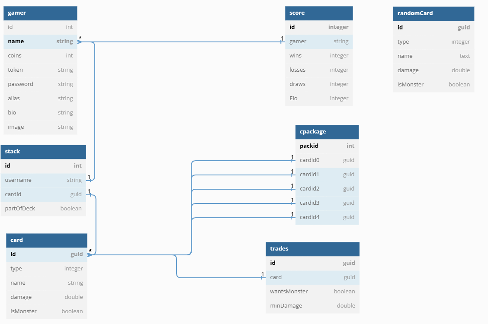

# MTCG
##Design Decisions
I started my design process by creating the tables in the database, as some tables were easily identified by reading the specification document. Starting this way makes me aware of the scope of the project and helps me to get started which I do sometimes have difficulties with.
This is the design of the database that I developed, which was updated a few times to meet the specification:


The table randomCard is not connected to the other ones in any way and is only used for the "Random Battle" feature described below.

After designing the first iteration of the database I went on to create methods to access the database. My next step was to parse incoming requests and create methods to send responses. Afterwards I created a basic REST server using the TCPClient library. This was the basic framework of my server which was expanded on by creating the needed methods to implement the functionality. 

## Lessons learned
This was my first c# project which meant, that I first had to get a basic understanding of c#. During the whole project design I was always slowed down by issues regarding Exceptions, caused by database queries, as PostgreSQL does not support MARS, which caused me to change and update the methods which were used to access the DB rather often. I found appreciation for good database implementation in combination with REST servers, as I found it very difficult to make sure, that no two threads are reading from a query at the same time. As I was not very proficient with object oriented programming, I was able to further my understanding and also improve my programming style, although there are still lots and lots of improvements to make. I also realized how tricky a lobby system can be and how hard it is to create a good one while avoiding some bad practices like active polling.

##Unit Testing
I tried to mock the database or the Rest-Server but found out rather fast, how difficult and time consuming it would be. Therefore I had to change the Unit tests to more testable components which is the Battle functionality.

##Optional Feature
I decided to implement a feature called “Random Battle” which takes ten random cards from a set of 45 cards. Each card can be drawn more than once. This feature has its own battlelobby and determines a win or a loss a bit differently. The player who took more cards from the opponent is the winner. This battle does not change the ELO, or the scoreboard at all and should be seen as a kind of quick casual matchmaking, between two players. This battle uses the same Battle class, but changes the win conditions a fair bit to make it much less common to get draws. 

I am very fond of the used sql-statement to get 10 random cards, as it is only a single query and I do not need to do 10 single queries:
```cs
string cmd = @"(SELECT * FROM randomcard ORDER BY random() limit 1)
                            UNION ALL
                            SELECT * FROM randomcard  LIMIT 10;";
                            using NpgsqlCommand sqlcmd = new NpgsqlCommand(cmd, this.con);

using var reader = sqlcmd.ExecuteReader();

while (reader.Read())
{
    Card card = new(reader.GetGuid(0), reader.GetString(2), reader.GetDouble(3));
    cards.Add(card);
}
return cards;
```
